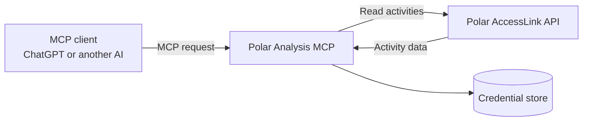

# Polar Analysis MCP

## What this project does

AI models cannot normally access data stored in services such as Polar Flow. The Model Context Protocol (MCP) provides a standard way to connect an AI application to external tools and data sources.

This project provides a read-only MCP server for Polar Flow. After a user authorizes their Polar account, an AI client can ask the server for training activities in a date range. The server retrieves the data from Polar and returns it as structured information that the AI can understand and analyse.

For example, a user can ask an MCP-compatible AI client:

> Retrieve my Polar activities from last week and summarize my training.

The server can be connected to ChatGPT or any other MCP client that supports the server's transport and authentication method.

## Technical overview

Polar Analysis MCP connects three components:

1. An MCP client, such as ChatGPT or another AI application.
2. This MCP server, which handles authentication and exposes Polar tools.
3. Polar AccessLink, which provides the user's activity data.



The main MCP tool is:

```text
get_activities(from_date, to_date, features=None)
```

It returns normalized Polar training sessions, including fields such as date, sport, duration, distance, heart rate, speed, power, and the additional data returned by Polar.

All Polar operations are read-only. The server does not create, update, or delete data in Polar Flow.

## Authentication model

The project uses two separate OAuth relationships:

- **MCP authentication** identifies the user connecting through the AI client.
- **Polar OAuth** allows the server to access that user's Polar account.

In hosted mode, the MCP server verifies the user's access token and uses the verified issuer and subject as the user's internal identifier. Polar access and refresh tokens are stored against that identifier. This prevents one authenticated user from retrieving another user's Polar activities.

Polar tokens remain on the server. They are never accepted as MCP tool arguments and are never returned to the AI client.

## Running modes

The same MCP service can run locally or on a generic hosting platform.

| Mode | Intended use | MCP authentication | Credential storage |
| --- | --- | --- | --- |
| Local | Personal use and development | Single development identity | Local SQLite database |
| Hosted | Multi-user remote MCP service | Auth0 OAuth access tokens | PostgreSQL or in-memory storage |

## Prerequisites

For both modes:

- Python 3.10 or newer.
- A Polar AccessLink application with a client ID and client secret.
- An MCP-compatible client.

Create the Polar application in the [Polar AccessLink administration interface](https://admin.polaraccesslink.com/). Register the exact HTTPS callback URL used by the selected running mode. Polar redirects the user's browser to this URL after authorization.

Hosted mode additionally requires:

- A public HTTPS domain for the MCP server.
- An Auth0 tenant configured as the MCP authorization server.
- A hosting platform capable of running the included Docker container.
- Optionally, PostgreSQL for persistent credentials and metrics.

### Local mode

Local mode runs the MCP server on the user's own machine. It can be used directly by a local MCP client through standard input/output, or through Streamable HTTP on localhost.

Install the project:

```bash
python3 -m venv .venv
source .venv/bin/activate
python -m pip install -r requirements.txt -e .
cp .env.local.example .env.local
```

Configure the Polar application values in `.env.local`, then start the server:

```bash
./scripts/start_local_mcp.sh
```

The Streamable HTTP endpoint is:

```text
http://127.0.0.1:8000/mcp
```

For a local MCP client that supports stdio:

```bash
python -m polar_mcp.local_mcp_server --transport stdio
```

The first Polar authorization requires the HTTP server and callback route described below. After credentials have been stored in SQLite, the stdio entry point can reuse them.

To connect a private local server to ChatGPT, the project also includes a launcher for the OpenAI Secure MCP Tunnel:

```bash
./scripts/start_local_mcp_tunnel.sh
```

Local Polar credentials are stored outside the repository in:

```text
~/.local/share/polar-mcp/credentials.sqlite3
```

Local mode is intentionally single-user and binds Streamable HTTP only to localhost. It must not be exposed as a public multi-user service.

#### Local Polar authorization callback

Polar requires a public HTTPS callback even when the MCP server runs locally. The repository includes a callback-only proxy that forwards `/polar/login` and `/polar/callback` to the local server without exposing `/mcp`:

```bash
./scripts/start_polar_oauth_callback_proxy.sh
```

Expose only `http://127.0.0.1:8081` through an HTTPS reverse tunnel. Set `POLAR_REDIRECT_URI` in `.env.local` to the resulting public URL followed by `/polar/callback`, and register that exact URL with Polar.

An optional launcher for a temporary Cloudflare Quick Tunnel is included:

```bash
./scripts/start_polar_oauth_tunnel.sh
```

This launcher expects the `cloudflared` executable at `tools/bin/cloudflared`. A different reverse-tunnel provider can be used as long as it exposes only the callback proxy.

### Hosted mode

Hosted mode runs the server as a public HTTPS MCP service. It can be deployed as a Docker container on any platform that supports a long-running web service and environment variables.

Build the container:

```bash
docker build -t polar-analysis-mcp .
```

The container starts:

```bash
python -m polar_mcp.hosted_mcp_server
```

The MCP client connects to:

```text
https://your-domain.example/mcp
```

Hosted mode requires Auth0 configuration so every MCP request has a verified user identity and the required `polar:activities:read` scope.

At a minimum, the Auth0 configuration must:

1. Define an API whose identifier matches `AUTH0_AUDIENCE`.
2. Add the `polar:activities:read` permission.
3. Allow the MCP client to request that permission.
4. Support OAuth authorization-code flow with PKCE.
5. Support MCP client registration, such as Dynamic Client Registration.
6. Preserve the MCP `resource` parameter so the issued token has the correct audience.
7. Enable at least one user login connection.

The MCP server publishes protected-resource metadata and validates Auth0 token signature, issuer, audience, expiry, and scope.

Required environment variables:

```text
MCP_PUBLIC_URL
AUTH0_DOMAIN
AUTH0_AUDIENCE
POLAR_CLIENT_ID
POLAR_CLIENT_SECRET
POLAR_REDIRECT_URI
```

Optional environment variable:

```text
DATABASE_URL
```

When `DATABASE_URL` is configured, PostgreSQL persistently stores per-user Polar credentials and aggregate request metrics. Without it, the server uses an in-memory store and users must reconnect Polar after the process restarts.

Configure these values through the hosting platform's secret manager. For local container testing, create the ignored `.env.local` file from the generic example, fill in the hosted values, and run:

```bash
cp .env.example .env.local
docker run --rm -p 8000:8000 --env-file .env.local polar-analysis-mcp
```

The public Polar callback must be:

```text
https://your-domain.example/polar/callback
```

The same callback URL must be registered in the Polar AccessLink administration interface.

## User flow

1. The user connects an MCP client to the server.
2. In hosted mode, the user authenticates through Auth0.
3. The user asks the AI client for Polar activities.
4. If no Polar account is connected, the MCP tool returns an authorization URL.
5. The user opens that URL and approves access in Polar.
6. The server stores the Polar credentials under the authenticated user identity.
7. Later MCP requests automatically refresh the Polar access token when necessary.
8. The requested activities are returned to the MCP client as structured data.

## Project structure

```text
src/polar_mcp/
    polar_mcp_server.py       Shared MCP tools and Polar OAuth routes
    local_mcp_server.py       Local single-user entry point
    hosted_mcp_server.py      Hosted Auth0-protected entry point
    polar_mcp_auth.py         MCP access-token verification and roles
    polar_mcp_oauth.py        Polar OAuth and credential stores
    polar_service.py          Polar activity retrieval and normalization

scripts/                      Local server and tunnel launchers
tests/                        Automated tests
Dockerfile                    Generic container entry point
```

## Security and privacy

- Polar access is read-only.
- Hosted requests require a valid OAuth access token.
- The server verifies token signature, issuer, audience, expiration, and scope.
- Each hosted user has a separate credential-store key.
- Polar tokens are never returned to MCP clients.
- OAuth state values are single-use and expire after a short period.
- Administrative metrics are aggregated and do not expose identities, tokens, or activity data.
- Secrets and generated credentials must not be committed to Git.

## Development

Install the test runner and run the existing automated tests with:

```bash
python -m pip install pytest
python -m pytest
```
